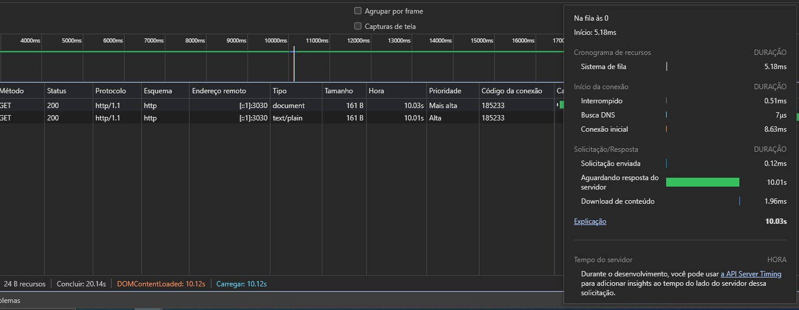
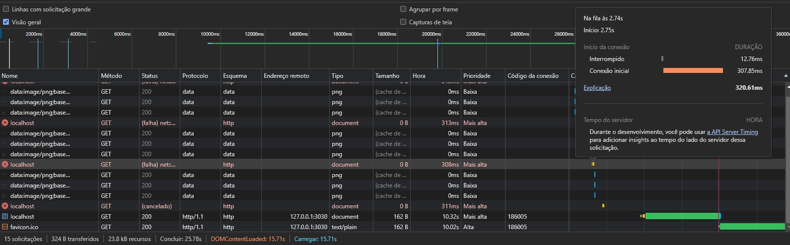

# Análise de Tier 1 do DevTools do Browser

Este projeto foi criado como parte de um estudo prático para aprender a lidar com o DevTools do Browser, especificamente para análise de Tier 1 (ou nível um). Neste contexto, exploramos a utilização do DevTools para depuração de um servidor simples.

## Sobre o Projeto

O objetivo principal deste projeto é entender como o DevTools pode nos ajudar a diagnosticar e resolver problemas comuns em servidores. Aqui, temos dois arquivos principais que simulam cenários comuns:

### Arquivos do Servidor

1. `processing.ts`: Este arquivo simula um processamento lento de requisições no servidor. Ao executar o servidor com este arquivo, poderemos observar como o DevTools nos mostra o tempo de resposta das requisições e identificar gargalos no processamento.

2. `slowConnection.ts`: Aqui, o arquivo simula um cenário onde o servidor está sobrecarregado e excede o limite permitido pela fila de conexões aceitas. Isso resulta em falhas de conexão. Utilizando o DevTools, podemos entender como o navegador lida com esses timeouts e como podemos ajustar nossas configurações de servidor para lidar com tais situações.

## Como Utilizar

1. Clone este repositório em sua máquina local:

   ```bash
   git clone https://github.com/seu-usuario/nome-do-repositorio.git
   ```

2. Instale as dependências do projeto:

   ```bash
   npm install
   ```

3. Para simular o processamento lento de requisições, execute:

   ```bash
   npm run start:processing
   ```

4. Para simular timeouts de conexão, execute:

   ```bash
   npm run start:slowConnection
   ```

5. Abra o DevTools do seu Browser (geralmente pressionando `F12` ou `Ctrl+Shift+I`) e vá para a guia de rede (Network) para observar os resultados.

## Exemplo de Resultados

### Processamento Lento de Requisições



Na imagem acima, podemos ver a análise de uma requisição que está demorando mais do que o esperado. Utilizando as ferramentas do DevTools, podemos identificar o motivo do atraso e otimizar o servidor, se necessário.

### Falha na conexão



Aqui, vemos como o DevTools nos mostra uma falha de conexão devido à sobrecarga do servidor que atingiu o número máximo de conexões em sua accept queue. Podemos usar essas informações para ajustar as configurações de conexão e evitar futuras.
